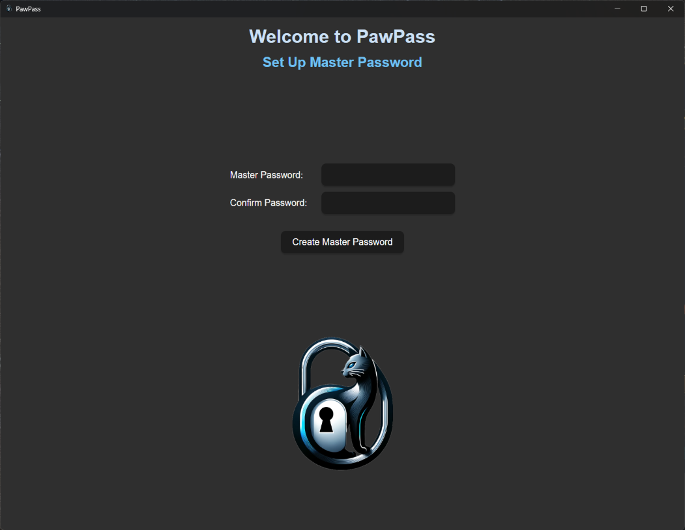
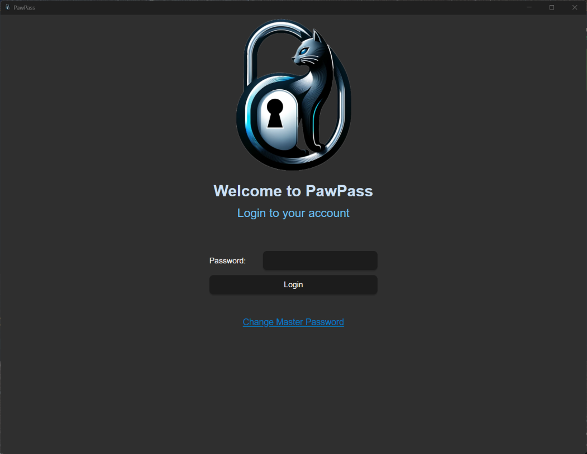
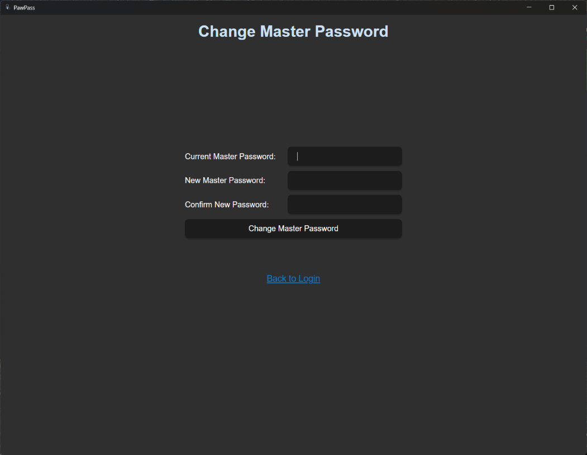
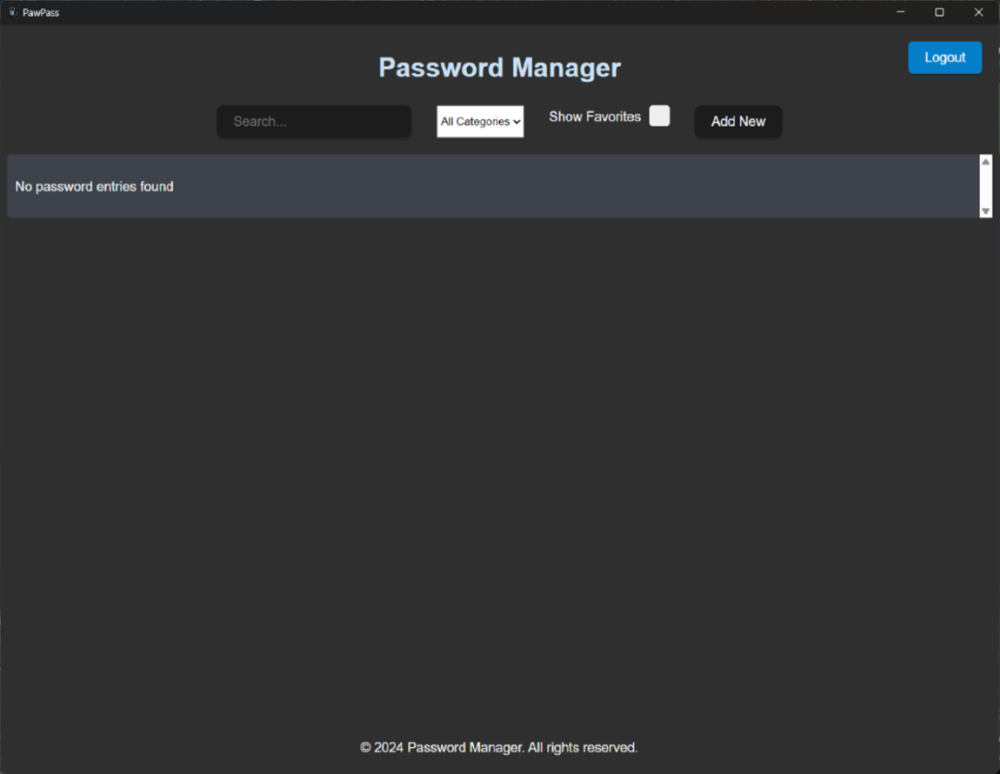
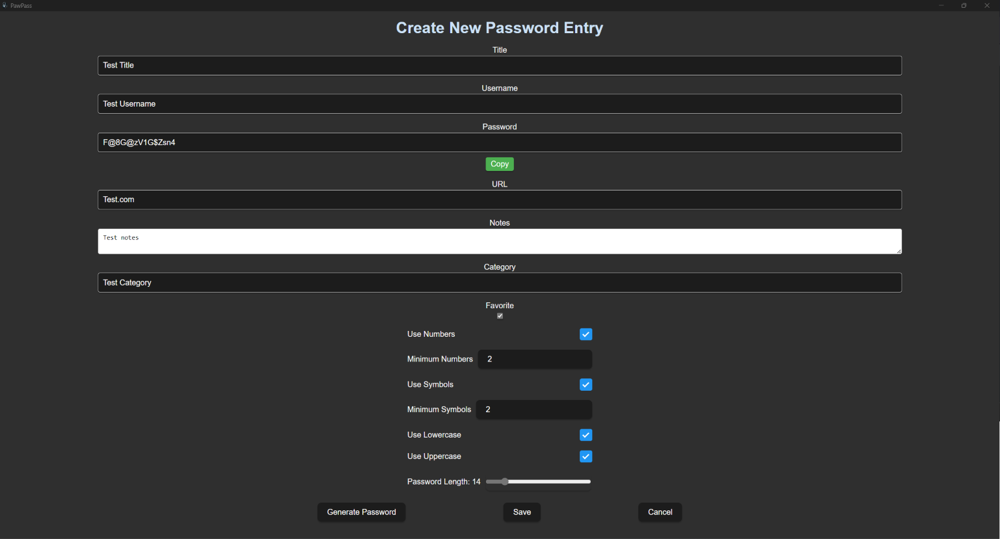
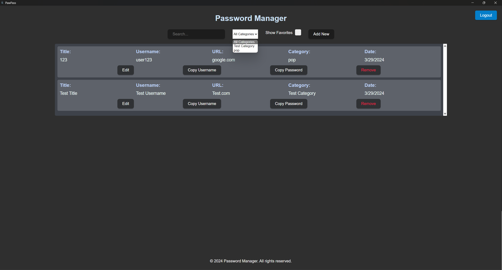
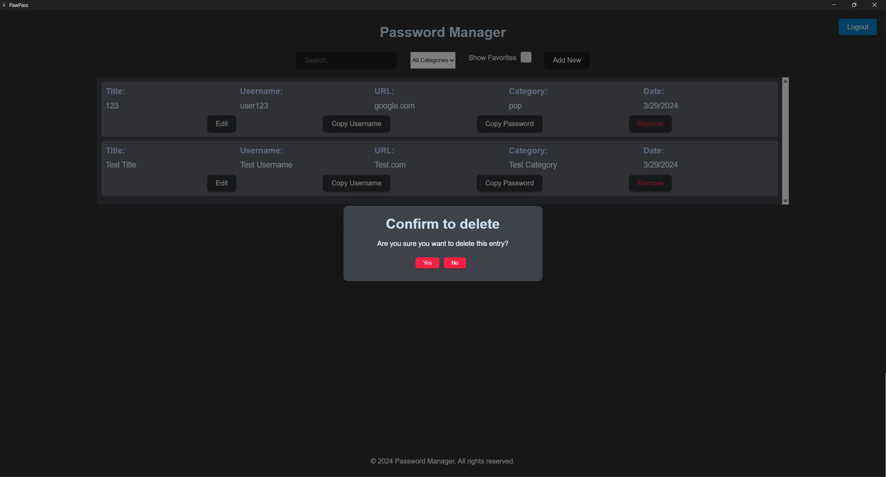

# Overview

PawPass is designed for individuals seeking a secure, efficient, and free solution for managing their passwords. It uniquely combines the power of Rust and Tauri for the backend to ensure maximum security and performance, with a sleek and intuitive interface built using TypeScript and React for the frontend. This blend of technologies not only guarantees a high level of security for stored data but also ensures a seamless user experience across various platforms.

The project was initiated as a personal challenge to create a viable alternative to existing password management solutions, specifically targeting students and individuals who might find the cost of premium password managers prohibitive. As a college student myself, I recognized the need for a tool that could offer robust password management capabilities without the associated costs. PawPass aims to fill this gap, providing users with the ability to generate strong, unique passwords, securely store them, and easily retrieve them as needed, all without any cost.

# Where to Install
Under the [Releases](https://github.com/seth-linares/PawPass/releases/tag/Password-Manager) tab, you can find the latest release of PawPass. There are 2 different installers: one which is a .exe file, and another which is a .msi file. While these are explicitly for Windows, the .msi file can be used on other operating systems with the use of a program such as Wine. 

# Walkthrough

## Installation

- After downloading the installer, run it to begin the installation process. You will be prompted to select a location to install PawPass. Once you have selected a location, click "Install" to begin the installation process. 

- Once the installation is complete, you can either have the installer launch PawPass for you or you can launch it yourself.

### File Location
- **Important**: The `pawpass.json` file is where your passwords are stored. If you modify this file, you will lose access to your passwords, so exercise caution when interacting with this file. 

- This file will only be created **after** you have created a master password, so if you do not initially see it, do not worry.

- It is by default located in the __Roaming folder__ of your AppData directory.
    - **Windows**: `C:\Users\<username>\AppData\Roaming\pawpass.json`

- This file will persist even after uninstalling PawPass, so if you reinstall PawPass, you will still have access to your passwords.
    

## Setup

- If this is your first time using PawPass, you will be brought to the setup screen. Here, you will be prompted to create a master password. This password will be used to encrypt and decrypt your passwords, so it is important to remember it. After creating your master password, you will be brought to the login screen. Here, you will enter your master password to access your passwords.

- The only requirement I set for the master password is that it must be at least 8 characters long. It is recommended to use a combination of letters, numbers, and special characters to create a strong password.

## Login

- If you have already created a master password and have a file saved, you will be brought straight to the login screen. Here, you will enter your master password to access your passwords.

## Change Master Password

- If you want to change your master password, you can do so by clicking the "Change Master Password" button. You will be prompted to enter your current master password, and then you can enter your new master password.

- *There is a hidden feature on this page so keep an eye out for it!*

## Main Screen

- After logging in, you will be brought to the main screen. Here, you can view all of your passwords, add new passwords, and generate new passwords. 

- The entries are displayed as row entries in the center of the page. In this image it is empty, but once you have added passwords, they will be displayed here.

- Above the entries is a row of features that includes:
    - **Search**: Allows you to search for a specific password entry.
        - Will match any part of the entry's title, username, or category.
    - **All Categories**: Dropdown menu that allows you to select the entries by category.
    - **Show Favorites**: Toggles whether to show only favorite entries or all entries.
    - **Add New**: Button that allows you to add a new password entry.

- In the top right corner, there is a button that allows you to log out. Clicking this button will log you out and bring you back to the login screen.

## Add New Entry

- This is the screen you will be brought to when you click the "Add New" button. Here, you can create a new password entry.

- For password generation, you can click the "Generate Password" button to generate a random password. 
    - You are given the following options:
        - **Use Numbers**: Toggles whether to include numbers in the password.
        - **Minimum Numbers**: The minimum number of numbers to include in the password.
        - **Use Symbols**: Toggles whether to include symbols in the password (e.g. !@#$%).
        - **Minimum Symbols**: The minimum number of symbols to include in the password.
        - **Use Lowercase**: Toggles whether to include lowercase letters in the password.
        - **Use Uppercase**: Toggles whether to include uppercase letters in the password.
        - **Password Length**: The length of the password on a slider from 6 to 128 characters (minimum changes based on the other options).

- You will be brought back to this screen when editing an entry, so the fields will be pre-filled with the entry's information.

## Example Entries

- Here are some example entries that have been added to the password manager.

- For each entry, you can see the title, username, URL, category, and Date (creation date).
- If you want to interact with an entry, you can click on:
    - The **Edit** button to edit the entry.
    - The **Copy Username** button to copy the username to your clipboard.
    - The **Copy Password** button to copy the password to your clipboard.
    - The **Remove** button to delete the entry.

- You can filter the entries by category using the dropdown menu at the top of the page as is shown in the image. You can also toggle whether to show only favorite entries or all entries.

## Remove Entry

- If you decide to remove an entry, you will be prompted to confirm your decision. If you click "Yes", the entry will be removed from the password manager.

# Development Environment

PawPass was developed using a combination of Rust and Tauri for the backend, providing a robust and secure foundation for password management. The frontend was crafted with TypeScript and React, offering a modern and responsive user interface.

- **Frontend**: TypeScript, React
- **Backend**: Rust, Tauri
- **Development Tools**: Visual Studio Code, GitHub for version control, and GitHub Actions for CI/CD.
- **Package Managers**: pnpm for frontend packages, cargo for Rust crates.

# Useful Websites

Throughout the development of PawPass, several resources were invaluable in overcoming challenges and learning new concepts. Here are some of the websites that were particularly helpful:

* [Tauri Docs](https://tauri.studio/docs/getting-started/intro)
* [Rust Book](https://doc.rust-lang.org/book/)
* [React Documentation](https://reactjs.org/docs/getting-started.html)
* [TypeScript Handbook](https://www.typescriptlang.org/docs/handbook/intro.html)
* [MDN Web Docs](https://developer.mozilla.org/en-US/)
* [Stack Overflow](https://stackoverflow.com/) for troubleshooting and community advice.
